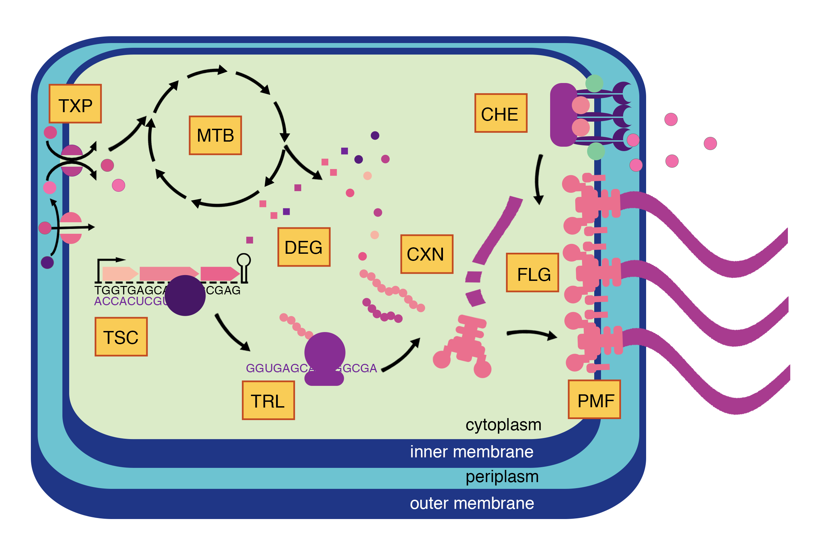

# Vivarium-chemotaxis

[Vivarium-chemotaxis](https://github.com/vivarium-collective/vivarium-chemotaxis) is a library for the 
multi-scale model of chemotaxis described in: [Agmon, E.; Spangler, R.K. A Multi-Scale Approach to 
Modeling E. coli Chemotaxis. Entropy 2020, 22, 1101.](https://www.mdpi.com/1099-4300/22/10/1101)

Supplementary materials can be found [here](doc/AgmonSpangler2020_supplementary.pdf).

Visit [the Vivarium Core documentation](https://vivarium-core.readthedocs.io/) to learn how to use the 
core Vivarium engine to create multi-scale computational biology models.



The [**Chemotaxis Master Composite**](chemotaxis/composites/chemotaxis_master.py), with processes for metabolism (MTB), 
transport (TXP), transcription (TSC), translation (TRL), complexation (CXN), degradation (DEG), proton motive 
force (PMF), flagella activity (FLG), and chemoreceptor activity (CHE). 
This repository includes the processes for CHE, FLG, and PMF; the other processes are imported from 
[vivarium-cell](https://github.com/vivarium-collective/vivarium-cell).

## Library
You might want to use the processes and composites in a different project. If so, they can be installed and imported
as a Python (pip) library. To install:
```
$ pip install vivarium-chemotaxis
```

## Setup
Please refer to the Vivarium Core documentation for more complete instructions.

Make a python environment with Python 3 (pyenv is recommended) and install dependencies. 

First install numpy:
```
$ pip install numpy
```

Then the remaining requirements:
```
$ pip install -r requirements.txt
```

MongoDB is required for some of the larger experiments that have experiment settings with 
{'emitter': {'type': 'database'}}. Follow instructions in the Vivarium documentation's
[Getting Started Guide](https://vivarium-core.readthedocs.io/en/latest/getting_started.html)
for instructions on MongoDB.

## Run individual processes and composites
Each process file under `chemotaxis/processes` can run on its own. Some of these have their own command line options.
For example, call the `chemoreptor_cluster` process with:
```
$ python chemotaxis/processes/chemoreptor_cluster.py
```

Composites with multiple integrated processes can also be executed on their own:
```
$ python chemotaxis/composites/chemotaxis_flagella.py
```

## Experiments
All experiments from the paper are available in the file `chemotaxis/experiments/paper_experiments.py`. Run them from 
the command line by specifying the corresponding figure number.
```
$ python chemotaxis/experiments/paper_experiments.py 7b
``` 

## Tests
Tests are performed with pytest. Simply call the following to ensure everything is working properly:
```
$ pytest
```

To run only the fast tests:
```
$ pytest -m 'not slow'
```

## Logging
To print out logging information, run a simulation with:
```
$ LOGLEVEL=INFO python chemotaxis/..
```
